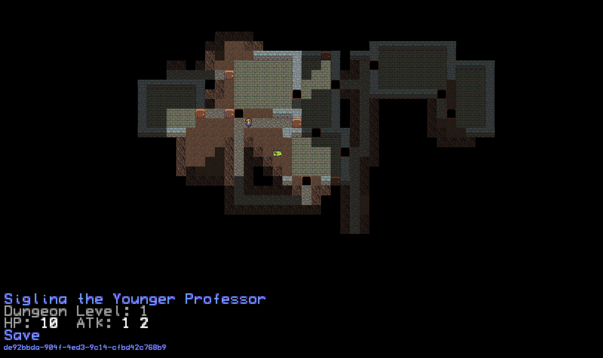
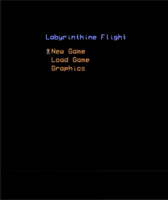

# LabyrinthineFlight
A roguelike web application written with Node.js, PixiJS, Socket.IO and rot.js.
Textures are by Lanea Zimmerman (https://opengameart.org/content/tiny-16-basic), Carl Olsson (https://opengameart.org/content/loveable-rogue), and Jerom (https://opengameart.org/content/16x16-fantasy-tileset).

The game currently allows players to explore levels of a randomly generated dungeon while being chased by a slime or skeleton based on the graphics a user selects. Users can save a game and load the game on another device. Every five levels, users will encounter a map that uses cave generation in addition to the standard dungeon generator.

The game also supports most mobile browsers and will allow users to take a game on the go even if they started it at home.

