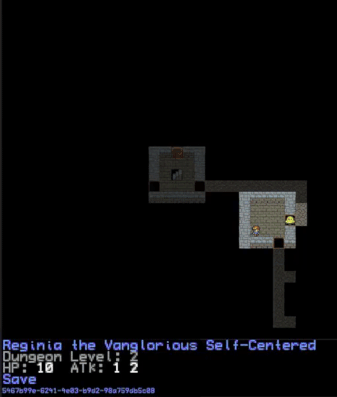

# LabyrinthineFlight

Currently refactoring since most of the code base was created for a project. Decisions made during that time, many parts of the project were implemented in the fastest way to have as many features as possible by presentation date. However, adding new core features that are necessary for a fun experience is nearly impossible. Hoping to create a more module and efficient codebase once this refactor is complete.

## Refactor plan.
1. Reduce all the data being written to and from the server. Less data needing to be transfer will lower cost of hosting and improve user experience.
2. Clean-up what happens when a player and enemy turns.
3. Item system 
4. In-game menus. This is needed to equip and consume items
5. World gen updates. Want to add shops on starting level. This will be the 'point assignment'/'starting equipment' menu. Allows player to buy their gear for the dungeon
    1. Possibly have them be able to travel back up to buy more items or have job assignments for tasks in the dungeon.
    2. Or, you rest in the inn before deciding to explore the dungeon, orcs attack, pushing you into the dungeon and collapsing the entrance.
6. Secret passages
7. Traps
8. Client/Server need to keep track of turn #. If there is ever a point where player turn is too far ahead of the world turn that is being sent from the server,
    pause the game and say waiting for server. Also not sure if there is ever a point where web sockets will be received out of order, but should still verify data
    is being sent in the right order. Hopefully this won't ever be a big deal, but once I start messing with sending less data and relying on previous data, this will be
    important. If things get too messy (FOV loaded incorrectly, enemy/player data is wrong), can request the server to send the full data instead of a diff as a reset to
    make sure client and server are on the same page.
9. Once items are a thing, will need to save all previous floors, not just the floors the player is currently on. 
10. Message system doesn't have to use canvas, and probably shouldn't. Instead use HTML scroll text boxes. This will be better for usability.
11. Pull as many things into an "engine" as possible so updating graphics will be easier.
    1. Calls to see a merchant screen should just send an array of the items they carry. When a player buys it, send the merchant id and item slot.
    2. Calls to update inventory will just be a JSON file and that will be parsed into an HTML interface or graphics if that is the eventual plan.

## Previous README

A roguelike web application written with Node.js, PixiJS, Socket.IO and rot.js.
Textures are by Lanea Zimmerman (https://opengameart.org/content/tiny-16-basic), Carl Olsson (https://opengameart.org/content/loveable-rogue), and Jerom (https://opengameart.org/content/16x16-fantasy-tileset).

The game currently allows players to explore levels of a randomly generated dungeon while being chased by a slime or skeleton based on the graphics a user selects. Users can save a game and load the game on another device. Every five levels, users will encounter a map that uses cave generation in addition to the standard dungeon generator.

The game also supports most mobile browsers and will allow users to take a game on the go even if they started it at home.

